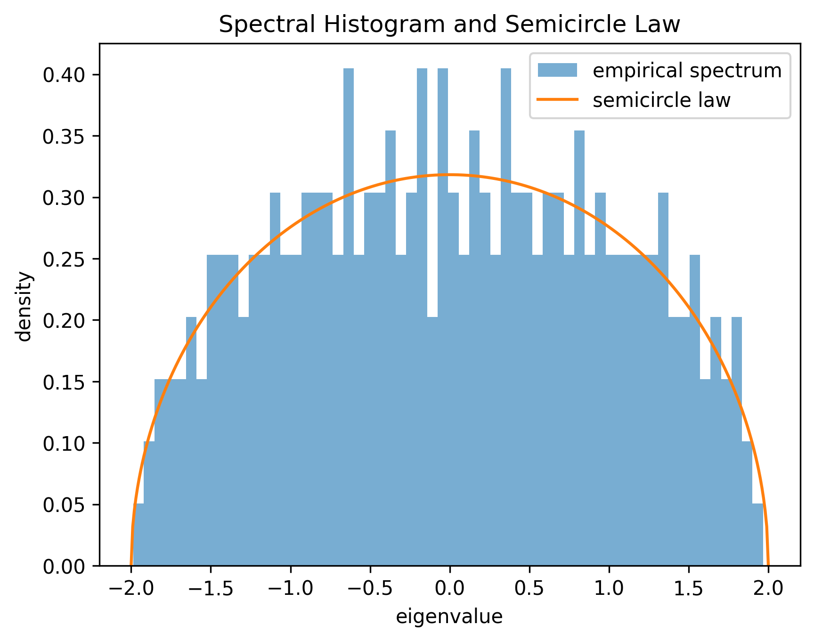
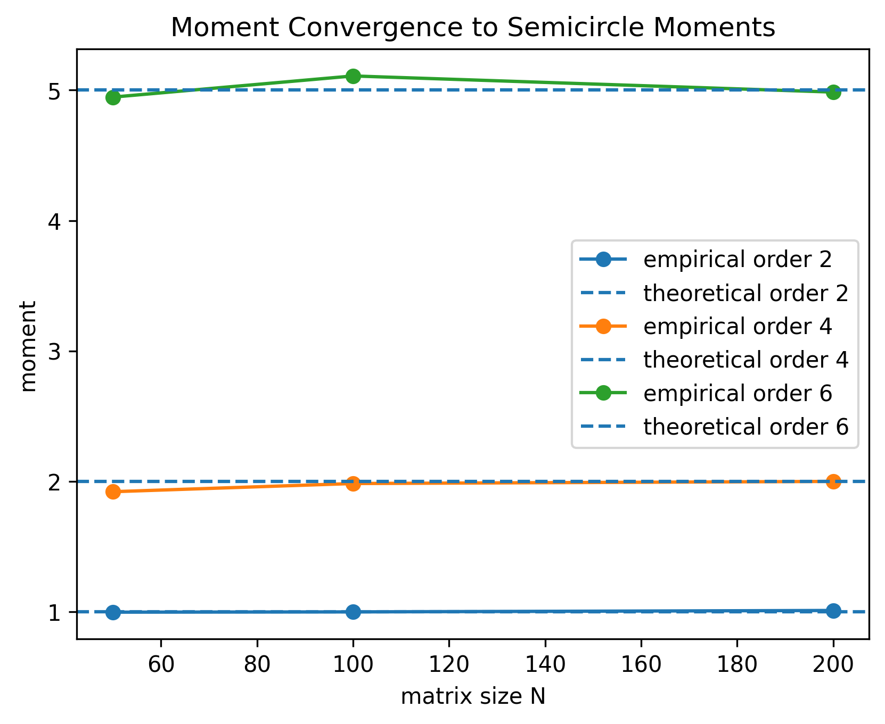
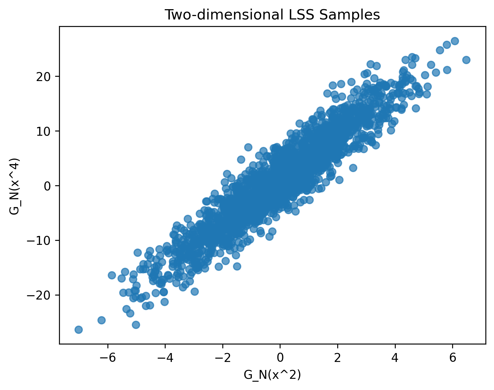
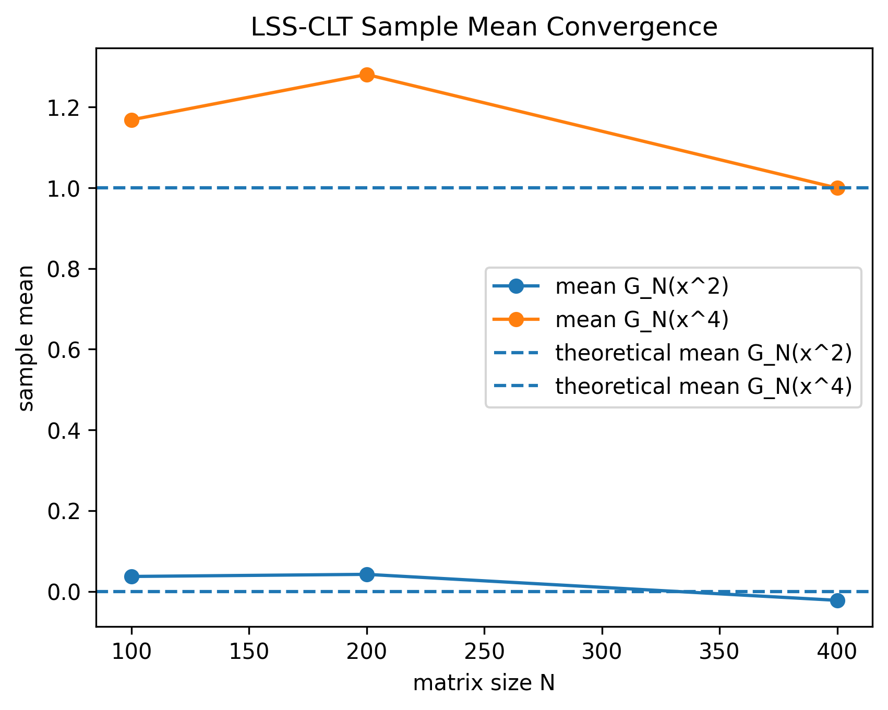
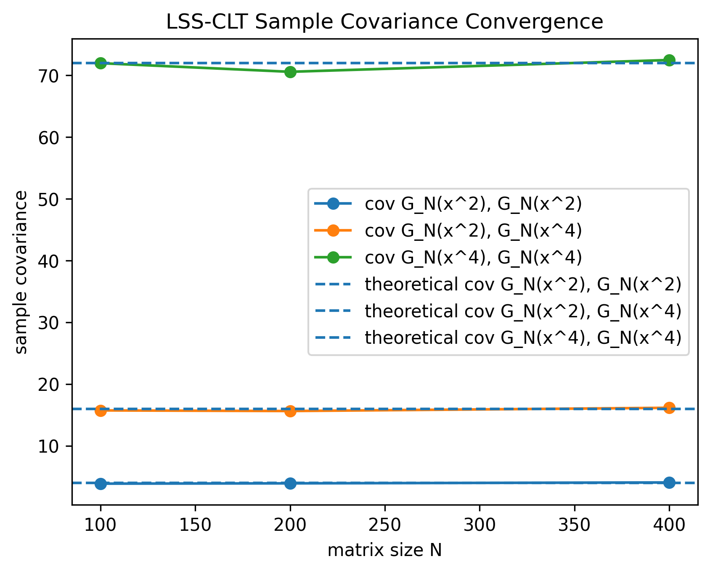

# Wigner Matrix Spectral Distribution: Theory and Numerical Experiments

## 项目简介

本项目基于本科毕业论文《Wigner 矩阵谱分布性质的理论分析与数值研究》，围绕 Wigner 随机矩阵的谱分布性质展开。项目通过 Python 数值实验复现论文中的半圆律收敛、矩量收敛、数值普适性和二维线性谱统计量中心极限定理实验。

## 研究内容

- Wigner 矩阵与经验谱分布
- Wigner 半圆律
- Catalan 数、Dyck 路与组合式矩量法
- KS 距离收敛实验
- 矩量收敛与 Catalan 数验证
- Wigner 半圆律的数值普适性
- 二维线性谱统计量中心极限定理实验

## 数学设定

经验谱分布：

```text
L_N = (1/N) sum_i delta_{lambda_i}
```

半圆律密度：

```text
rho_sc(x) = 1/(2*pi) * sqrt(4 - x^2) * 1_{[-2,2]}(x)
```

经验矩量：

```text
m_k^N = (1/N) sum_i lambda_i^k
```

半圆分布奇数阶矩为 `0`，偶数阶矩为 Catalan 数。

二维 LSS-CLT 实验使用：

```text
f1(x) = x^2
f2(x) = x^4
L_N(f) = (1/N) sum_i f(lambda_i)
G_N(x^2) = N(L_N(x^2) - 1)
G_N(x^4) = N(L_N(x^4) - 2)
```

理论参考值：

```text
mean = [0, 1]
cov = [[4, 16], [16, 72]]
```

## 项目结构

```text
src/
tests/
docs/
paper/
notebooks/
assets/
results/
```

## 环境配置

```powershell
python -m venv .venv
.venv\Scripts\activate
pip install -r requirements.txt
```

## 论文正文实验复现

本项目提供 `--preset thesis`，用于复现论文正文中的正式实验参数。

KS 距离收敛实验：

```bash
python -m src.experiments --experiment ks --preset thesis
```

矩量收敛实验：

```bash
python -m src.experiments --experiment moments --preset thesis
```

数值普适性实验：

```bash
python -m src.experiments --experiment universality --preset thesis
```

二维 LSS-CLT 实验：

```bash
python -m src.experiments --experiment lss_clt --preset thesis
```

仍可使用自定义参数，例如：

```bash
python -m src.experiments --experiment lss_clt --matrix-sizes 100,200,400 --num-trials 2000 --dist gaussian --seed 0
```

## 论文正文参数

KS 距离收敛实验：`matrix_sizes=(50,100,200,400,800,1600)`，`num_trials=20`，`dist="gaussian"`。

矩量收敛实验：`matrix_sizes=(50,100,200,400,800,1600)`，`orders=(2,4,6)`，`num_trials=20`，`dist="gaussian"`。

数值普适性实验：`n=400`，`repeats=10`，`distributions=("gaussian","rademacher","uniform")`，`seed=42`。

二维 LSS-CLT 实验：`matrix_sizes=(50,100,200,400,800)`，`num_trials=1000`，`dist="gaussian"`。

## 主要输出

```text
results/tables/ks_convergence.csv
results/figures/ks_convergence.png
results/tables/moment_convergence.csv
results/figures/moment_convergence.png
results/figures/universality_comparison.png
results/tables/lss_clt_summary.csv
results/figures/lss_clt_2d_scatter.png
results/figures/lss_clt_2d_mean.png
results/figures/lss_clt_2d_cov.png
```

## 实验图像展示











## 结果解释

数值实验用于有限维模拟验证理论趋势，不应理解为严格数学证明。KS 距离和矩量误差不一定严格单调下降。LSS-CLT 实验中，样本均值和协方差矩阵会受到有限样本 Monte Carlo 误差影响，且 `G_N(x^4)` 的波动通常比 `G_N(x^2)` 更明显。

## 测试

```bash
pytest
```

测试使用小规模参数，不运行 thesis preset 的大规模实验。

## 论文说明

`paper/thesis_summary.md` 是论文摘要式说明，不包含个人隐私信息。项目暂不上传含姓名、学号、导师信息的原始论文 PDF。

## 免责声明

本项目用于数学科研学习与数值实验复现，不构成其他用途。
